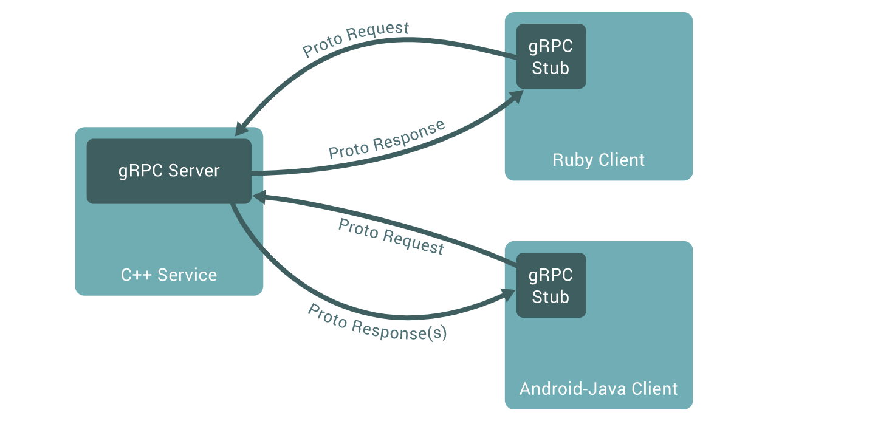

在聊 `gRPC` 之前我们先来了解下什么是 `rpc`。

### 什么是rpc?

`RPC`  是 `Remote Procedure Call` 的简称，中文我们一般叫做远程过程调用。`RPC` 是一种服务器-客户端（Client/Server）模式，经典实现就是一个通过**发送请求-接受回应**进行信息交互的系统。

`RPC` 的客户端和服务端可以在一台机器上，也可以在不同的机器上，对于开发者来说，调用 `RPC` 服务的时候，就跟调用本地函数一样。对于开发者来说。

### http 和 rpc 有什么区别？

首先这个问题本身不太严谨。

` http` 只是一个工作在应用层的传输协议。

 而 `RPC` 是一个完整的远程调用方案。

它包含了:

- 接口规范
- 数据序列化规范
- 传输协议

这样看，`RPC` 和 `http` 的关系只可能是包含关系。为什么是可能？因为 `RPC` 传输协议那块我可以不基于 `http` 呀。

这个问题应该改成:基于 `http` 的远程调用方案 (如:http +RestFul(接口规范)+json(数据序列化规范)) 和直接使用 rpc 远程调用方案有什么区别？

#### RPC 和 gRPC 有什么关系？

`gRPC` 是由 `google` 发起的一个 RPC  框架，基于 HTTP/2 协议传输。使用 `Protocol Buffers` 作为序列化协议。关于 `Protocol Buffers` 是一种与语言、平台无关 、可扩展的序列化结构数据格式。类似 `JSON`、`XML`等数据描述语言。更多关于 `Protocol Buffers`,我写了另一篇文章。

### RPC 是如何进行远程调用的

官网有一张图:

用 gRPC 来进行远程调用客户端(client) 仅仅需要 `gRPC Stub` (为啥叫存根啊？) 通过 `Proto Request` 向 `gRPC Server` 发起服务调用即可，然后 `gRPC Server` 通过 `Proto Response(s)` 将调用结果返回给  `client`。

更具体的说明可以查看文档。

